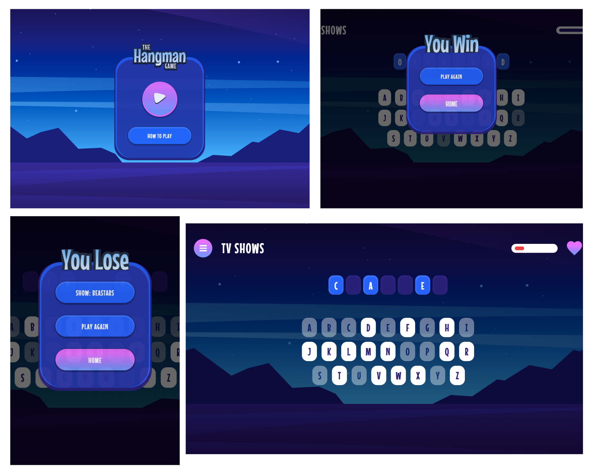

# Hangman  

A React-based word-guessing game where players attempt to uncover hidden words by guessing letters.  

  

[Live Demo](https://hangman-one-beige.vercel.app/)  

## Description  

Hangman is an engaging word-guessing game that tests players' vocabulary and deduction skills. Players select a category and attempt to guess a randomly chosen word by inputting letters. Incorrect guesses reduce health, and the game ends either when the word is correctly guessed or the player runs out of health.  

## Features  

- Multiple categories to choose from: Movies, TV Shows, Countries, and Capital Cities  
- Random word generation based on the selected category  
- Visual feedback on correct and incorrect guesses  
- Health tracking with a maximum of 10 incorrect guesses  
- Pause menu with options to continue, pick a new category, or quit  
- Fully responsive design using Tailwind CSS  
- Keyboard navigation for accessibility  

## Technologies Used  

- React  
- Vite  
- Tailwind CSS  
- JavaScript (ES6+)  

## Project Structure  

- `src/components/`  
  - `HowToPlayButton.jsx`: Button component that shows instructions on how to play.  
  - `Intro.jsx`: Handles the game's introduction screen.  
  - `Paused.jsx`: Pause menu with options to continue, restart, or quit the game.  
  - `PlayButton.jsx`: Start game button component.  
  - `ReturnButton.jsx`: Button for returning to the main menu.  
  - `YouLose.jsx`: Screen displayed when the player loses.  
  - `YouWin.jsx`: Screen displayed when the player wins.  

- `src/data/`  
  - `letters.js`: Contains the alphabet data used for the guessing logic.  

- `src/pages/`  
  - `Categories.jsx`: Renders the category selection screen.  
  - `GamePage.jsx`: Core gameplay logic and rendering.  
  - `Homepage.jsx`: Main homepage of the game.  
  - `HowToPlayPage.jsx`: Displays instructions on how to play the game.  

- `App.jsx`: Main application logic and routing setup.  
- `index.css`: Global styling.  

## Getting Started  

To run this project locally:  

1. Clone the repository  
2. Install dependencies with `npm install`  
3. Start the development server with `npm run dev`  

## How it Works  

### Key Functionalities  

- Generates a random word from the selected category  
- Tracks guessed letters and updates the word display accordingly  
- Reduces health for each incorrect guess, with a maximum of 10 wrong guesses  
- Displays a "Game Over" screen when health reaches zero or the word is guessed  

### State Management  

- React `useState` is used for:  
  - Tracking guessed letters  
  - Current word and category  
  - Player's remaining health  
  - Game state (ongoing, paused, or over)  

### Accessibility  

- Supports keyboard input for all interactions  
- Focus and hover effects for interactive elements  
- Responsive layout optimized for both mobile and desktop screens  

## Game Rules  

1. Select a category to start the game.  
2. Guess letters by typing on your keyboard.  
3. Correct guesses reveal the letters in the word.  
4. Incorrect guesses reduce health by one.  
5. Win the game by guessing the word before health reaches zero.  
6. Lose the game if all health is lost before guessing the word.  

## Future Enhancements  

- Add more categories and word collections.  
- Include multiplayer mode with a timer for competitive play.  
- Add animations for incorrect guesses and word reveals.  
- Improve visual accessibility with customizable themes.  

## Acknowledgments  

This project was inspired by the classic Hangman game and built to practice React, Tailwind CSS, and game logic design.  
